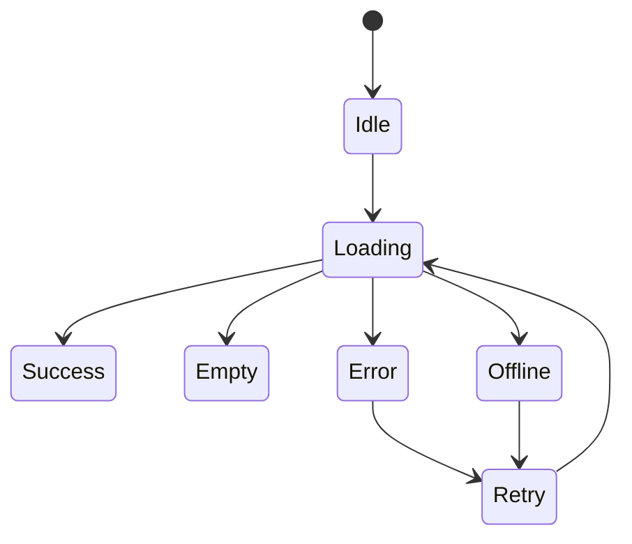

# Frontend Reliability

## Rules

- Bound network timeouts and retries at one layer; do not multiply retries across
  hooks, clients, and UI actions.
- Cancel or suppress stale requests when a feature state changes.
- Mutations require idempotency or an explicit disabled/retry policy.
- Loading, empty, error, offline, and permission-denied states are first-class UI
  states, not exceptional styling.
- Service-worker caching MUST never make an authenticated mutation appear to have
  succeeded or serve stale private data.
- Error boundaries protect unrelated routes without hiding the failure signal.

## Verification

- [ ] Dependency timeout and retry behavior is tested.
- [ ] Duplicate-click and stale-response behavior is tested.
- [ ] Offline and recovery states are user-observable.
