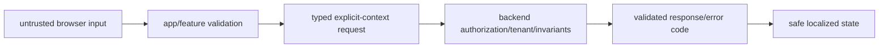

# Frontend Security

Browser code and every `VITE_*` value are public. The backend remains the
authority for identity, authorization, tenant isolation, validation,
persistence, and business invariants.

Frontend defense in depth includes approved session storage, explicit tenant
context, capability-aware UI, output safety, CSP/headers at delivery,
dependency/secret scanning, and telemetry redaction. These controls never
replace backend enforcement.

## Security checklist

- [ ] No private credential appears in source, config, logs, artifacts, or UI.
- [ ] Untrusted input/HTML/URLs and API responses are validated at boundaries.
- [ ] Unauthorized, forbidden, and tenant-mismatch behavior is tested without
      exposing restricted data.
- [ ] Session, storage, CSRF/CORS/header, cache, and logout behavior follows the
      approved threat boundary.
- [ ] Raw transport errors and stack traces never reach presentation.
- [ ] Dependency/secret scans pass; exceptions have owner, control, and expiry.
