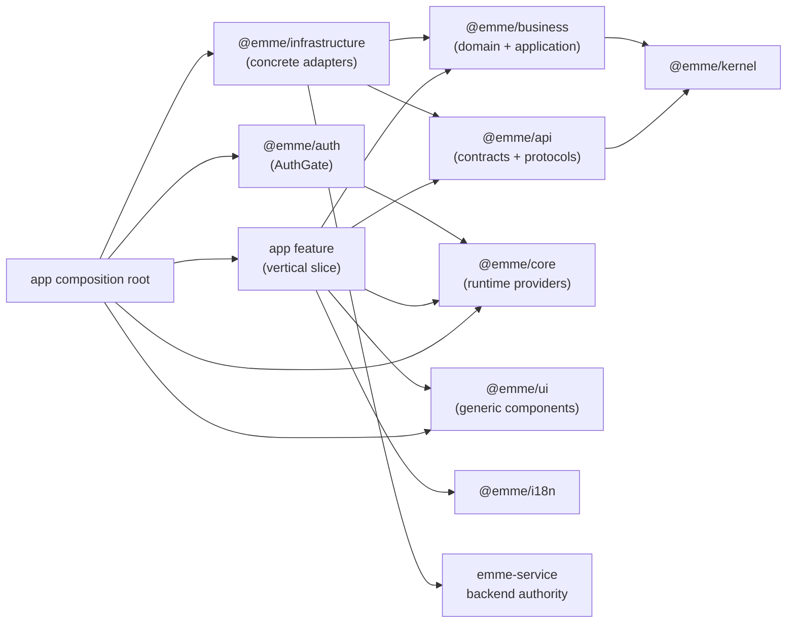

# EMME Web Project Architecture Specification

| Field | Value |
| --- | --- |
| Status | Draft — consolidated handoff specification |
| Date | 2026-08-10 |
| Repository | [`migangdelzar/emme-web`](https://github.com/migangdelzar/emme-web) |
| Source branch | `feat/api-version-contract` |
| Verified source commit | `cf732f3` |
| Primary consumer | Google AI Studio / AI coding agents |
| Normative handbook | [`docs/architecture/README.md`](README.md) |

## 1. Purpose

This document is the project-level handoff for reproducing the EMME web
architecture in another AI coding environment. It explains the current
repository structure, architectural patterns, package ownership, dependency
direction, runtime boundaries, testing strategy, and rules that must be
preserved while building the client and admin applications.

The project is a Bun workspace containing three independently deployable React
applications:

- `salon-app`: tenant-owner and staff salon management;
- `client-app`: customer-facing booking and account experience;
- `admin-app`: platform administration.

The applications share stable technical and business packages, but they do not
share product feature internals. The salon application currently owns the
implemented product workflows. Client and admin currently have application
shells and authentication boundaries; their product features are added locally
as those products are developed.

## 2. Architecture classification

This project is a hybrid architecture. The patterns apply at different scopes;
they are not four competing or uniformly applied architectures.

| Pattern | Scope | How it is used |
| --- | --- | --- |
| FSD-inspired feature slicing | Frontend applications | Organizes code by deployable app and vertical business feature. It is not canonical FSD with mandatory `entities`, `widgets`, and `pages` layers. |
| Hexagonal / Clean Architecture | Shared business and integration boundaries | Separates framework-free domain/application behavior from API contracts and concrete infrastructure adapters. |
| Pragmatic capability-oriented DDD | Business packages and feature boundaries | Groups rules and use cases by capabilities such as appointments, clients, and services. It uses DDD concepts where they clarify ownership; it is not enterprise DDD everywhere. |
| Component-Driven Development (CDD) | Shared UI package | Builds generic UI components independently in `@emme/ui`; applications compose them into business workflows. |

The accurate short description is:

> EMME uses FSD-inspired vertical feature slices in the frontend,
> Hexagonal/Clean boundaries for shared business and infrastructure,
> pragmatic capability-oriented DDD for business modeling, and
> Component-Driven Development for the shared UI system.

Do not transform the project into canonical FSD. Do not create generic global
`entities`, `widgets`, `use-cases`, or `infrastructure` folders in every
frontend feature unless a specific feature genuinely needs that responsibility.

## 3. Source-of-truth and version policy

When documents and code disagree, use this order:

1. Source code and package manifests on the active implementation branch.
2. Canonical pages indexed by [`docs/architecture/README.md`](README.md).
3. Architecture decisions and current migration plans referenced by that
   handbook.
4. Historical or superseded plans for context only.

### 3.1 Important branch distinction

At the time this specification was written, `main` still contains an older
package topology. The current architecture is on
[`feat/api-version-contract`](https://github.com/migangdelzar/emme-web/tree/feat/api-version-contract).
For an exact AI Studio import, use that branch or merge it into `main` first.

The active branch uses:

```text
apps/admin-app
apps/client-app
apps/salon-app
packages/business
packages/kernel
packages/auth
```

The following names belong to superseded architecture documents and must not be
reintroduced:

```text
apps/emme-salon-app
apps/platform-admin-app
packages/features
packages/domain
packages/application
@emme/features
```

The 2026-08-08 complete-monorepo design is retained as historical decision
context where it describes those old names. The 2026-08-09 salon-first design
and the architecture handbook define the current ownership model.

## 4. Repository structure

The repository is a Bun workspace. Apps are composition roots and deployable
artifacts. Packages are reusable boundaries. `e2e` owns cross-application
browser journeys. `docs` owns architecture and operational documentation.

```text
emme-web/
├── apps/
│   ├── admin-app/                 # platform administration deployable
│   ├── client-app/                # customer-facing deployable
│   └── salon-app/                 # tenant-owner/staff deployable
├── packages/
│   ├── api/                       # transport contracts and API operations
│   ├── auth/                      # shared AuthGate boundary primitive
│   ├── business/                  # framework-free business capabilities
│   ├── core/                      # auth, tenancy, permissions, runtime
│   ├── i18n/                      # translations and formatting
│   ├── infrastructure/            # concrete HTTP, auth, storage, telemetry
│   ├── kernel/                    # pure Result, errors, IDs, clock primitives
│   ├── test-support/              # shared fakes, fixtures, providers
│   ├── ui/                        # generic component-driven UI library
│   └── validation/                # reusable schema primitives
├── configs/                       # shared ESLint, Prettier, TS, Vite config
├── deploy/                        # Compose, Docker, and Kubernetes
├── e2e/                           # Playwright cross-app tests
├── docs/                          # architecture, runtime, delivery, operations
├── scripts/                       # repository validators and automation
├── tasks/                         # auditable implementation notes and plans
├── package.json
└── bun.lock                       # authoritative dependency lockfile
```

Root rules:

- no package may import application source;
- no application may import another application;
- apps consume packages through package exports, not `packages/*/src` paths;
- `bun.lock` and the root `package.json` define workspace and toolchain policy;
- private credentials, generated output, `node_modules`, and local auth
  artifacts do not belong in an AI Studio handoff.

## 5. Application architecture

Each app is an independent composition root. The shell owns runtime setup and
cross-feature concerns; features own product workflows.

### 5.1 Common app shell

```text
apps/<app>/
├── index.html
├── package.json
├── tsconfig.json
├── vite.config.ts
└── src/
    ├── app/
    │   ├── App.tsx
    │   ├── AppProviders.tsx
    │   ├── router.tsx
    │   ├── config/              # validated public runtime config when needed
    │   ├── layouts/             # app-wide layout when needed
    │   ├── auth/                # app-shell auth boundary when needed
    │   └── error-boundary/       # normalized error UI when needed
    ├── features/                # app-owned user outcomes
    ├── theme/                   # app-specific global styling when needed
    ├── setupTests.ts
    └── main.tsx
```

Not every app or feature must contain every optional directory. Empty
architectural folders are not created merely to satisfy a template.

Startup composition is:

```text
main.tsx
  → validated public runtime configuration
  → error boundary
  → AppProviders
  → session/auth provider
  → tenant provider where applicable
  → permission and feature-flag providers
  → query and i18n providers
  → router and layout
  → app-local workflow
  → feature public API
```

Concrete network, storage, authentication, telemetry, and provider adapters are
created and wired by the composition root, normally `AppProviders.tsx` and its
app configuration. Feature code receives protocols or package-provided
contexts; it does not construct infrastructure internally.

### 5.2 Current salon-app structure

The salon app is the reference implementation for the other applications.

```text
apps/salon-app/
├── public/                       # PWA icons, manifest, runtime config shell
├── .env.example                  # public browser configuration example
├── capacitor.config.ts           # native packaging configuration
├── dev-proxy.mjs                 # local development proxy
├── package.json
├── vite.config.ts
├── vitest.config.ts
└── src/
    ├── app/
    │   ├── App.tsx
    │   ├── AppProviders.tsx
    │   ├── router.tsx
    │   ├── auth/                 # composition/transport boundary tests
    │   ├── config/runtimeConfig.ts
    │   ├── error-boundary/
    │   └── layouts/AppLayout.tsx
    ├── features/
    │   ├── appointments/{api,components,hooks,mappers,presentation,shared,validation}/
    │   ├── auth/components/
    │   ├── clients/{api,components,domain,hooks}/
    │   ├── dashboard/{components,hooks}/
    │   ├── finances/{components,hooks}/
    │   ├── google-workspace/{components,hooks}/
    │   ├── navigation/
    │   ├── onboarding/{application,components,presentation}/
    │   ├── services/{api,components,domain,hooks,mappers}/
    │   ├── settings/{api,components,context,hooks}/
    │   ├── shared/{apiErrorMessage,queryFactory,uiStore}.ts
    │   └── feature-boundary.test.ts
    ├── setupTests.ts
    ├── theme/globals.css
    └── main.tsx
```

The feature directory is a vertical slice. A feature may contain pages, route
composition, components, hooks, state, validation, API query composition,
mappers, and app-specific domain rules. It only creates the subfolders it
needs.

Current salon feature responsibilities:

| Feature | Responsibility |
| --- | --- |
| `appointments` | Appointment listing, calendar/form presentation, queries, mapping, validation, and status UI. |
| `auth` | Salon login and tenant-selection presentation; the shared gate is in `@emme/auth`. |
| `clients` | Salon customer/client management presentation and queries. |
| `dashboard` | Salon dashboard data and presentation. |
| `finances` | Finance workflow presentation and data hooks. |
| `google-workspace` | Calendar, OAuth, Sheets, and account integration workflows. |
| `navigation` | Salon navigation and route-facing navigation presentation. |
| `onboarding` | Tenant onboarding workflow with local application ports and presentation. |
| `services` | Service catalog presentation, rules/types, queries, and view mapping. |
| `settings` | Tenant/business profile settings, context, queries, and presentation. |
| `shared` | Salon-local helpers and UI state with demonstrated cross-feature use. |

### 5.3 Current client and admin shells

The client and admin apps remain separate deployables and do not consume salon
feature internals.

```text
apps/client-app/src/
├── app/
│   ├── App.tsx
│   ├── AppProviders.tsx
│   ├── router.tsx
│   ├── clientRuntimeConfig.ts
│   └── route-boundary tests
├── features/auth/
│   ├── ClientLoginPage.tsx
│   ├── ClientOidcCallbackPage.tsx
│   └── clientOidc.ts
├── theme/globals.css
└── main.tsx

apps/admin-app/src/
├── app/
│   ├── App.tsx
│   ├── AppProviders.tsx
│   ├── router.tsx
│   └── route-definition tests
├── features/auth/AdminLoginPage.tsx
└── main.tsx
```

New client or admin capabilities follow the same local structure:

```text
apps/client-app/src/features/<client-capability>/
apps/admin-app/src/features/<admin-capability>/
```

They may consume shared contracts, business capabilities, runtime providers,
and generic UI. They may not import `apps/salon-app/src/features/*`.

## 6. Feature structure and boundaries

The project uses feature-oriented vertical slices rather than a global
technical-layer tree.

### 6.1 Feature directory rules

```text
apps/<app>/src/features/<capability>/
├── pages/                       # route-level composition when needed
├── components/                 # capability-specific UI
├── hooks/                      # React/query/workflow orchestration
├── api/                        # feature query/mutation composition
├── mappers/                    # transport/domain output to view models
├── domain/                     # local app-only rules/types when justified
├── application/                # local orchestration/ports when justified
├── infrastructure/             # feature adapter for a local port
├── presentation/              # view models and presentation components
├── state/                      # feature-local state when needed
├── validation/                 # form, URL, and filter schemas
├── shared/                     # feature-local reusable pieces
├── test/                       # feature fixtures/integration tests when needed
└── index.ts                    # public feature boundary
```

Rules:

- one feature represents one coherent user or business outcome;
- feature UI and workflow code remains in the owning app;
- cross-feature imports use public `index.ts` exports only;
- a feature never imports another feature's private files;
- route, navigation, permission, and role workflow decisions are app-owned;
- API query composition may be feature-local, while transport contracts belong
  in `@emme/api`;
- feature mappers translate transport/application results into view models;
- backend validation and authorization remain authoritative;
- features define loading, empty, error, forbidden, unavailable, and success
  behavior where applicable.

### 6.2 Shared extraction rule

Code is not moved to a shared package because two screens look similar. Extract
only when there is a demonstrated second consumer, stable semantics, an
explicit testable public contract, and no leakage of app-specific routes, roles,
branding, or policy.

The shared authentication package is intentionally narrow: `@emme/auth` owns
the `AuthGate` primitive, while every app owns its login and tenant-selection
presentation.

## 7. Package architecture

### 7.1 Package ownership

| Package | Owns | Must not own |
| --- | --- | --- |
| `@emme/kernel` | `Result`, typed errors, branded IDs, clock protocols, stable primitives | React, browser APIs, HTTP, DTOs, application logic, infrastructure |
| `@emme/business` | Reusable domain rules, application use cases, DTOs, and ports grouped by capability | React, browser APIs, routing, query libraries, concrete adapters |
| `@emme/api` | Transport protocols, API contracts, request/response types, parsing, and typed transport errors | React, storage, concrete browser clients, business policy |
| `@emme/infrastructure` | Concrete HTTP, auth, tenant storage, browser storage, telemetry, provider adapters | Domain rules, page workflows, authorization policy |
| `@emme/core` | Auth/session context, tenancy, permissions, runtime configuration, error/runtime providers | Appointment/client/service workflows and concrete global adapters |
| `@emme/auth` | Shared authentication gate primitive | Login pages, tenant-selection presentation, salon workflows |
| `@emme/ui` | Generic accessible components, design tokens, layout, forms, feedback, data display | Business concepts, app routes, API/application/infrastructure imports |
| `@emme/i18n` | Translation engine, shared catalogs, and formatters | Feature workflow decisions and business policy |
| `@emme/validation` | Reusable schema primitives and boundary helpers | Page-specific workflow orchestration |
| `@emme/test-support` | Test-only fakes, fixtures, providers, handlers, and setup | Production behavior and runtime dependencies |

### 7.2 Business capability structure

Reusable business behavior is organized vertically by capability, with domain
and application as internal layers:

```text
packages/business/src/
├── appointments/
│   ├── domain/
│   │   ├── appointment-status.ts
│   │   ├── appointment.rules.ts
│   │   ├── appointment.types.ts
│   │   └── index.ts
│   ├── application/
│   │   ├── cancel-appointment.ts
│   │   ├── salon/list-salon-appointments.ts
│   │   ├── ports/appointment-repository.ts
│   │   └── index.ts
│   └── index.ts
├── clients/
│   ├── domain/
│   ├── application/
│   └── index.ts
├── services/
│   ├── domain/
│   └── index.ts
└── index.ts
```

The package is framework-free. Domain and application code is testable without
React, a browser, a network, or a database.

### 7.3 Hexagonal/Clean mapping

```text
                    external systems
                           ▲
                           │
             concrete adapters / infrastructure
                           │ implements
                           ▼
          application ports and transport protocols
                           ▲
                           │ used by
                           ▼
              application use cases / orchestration
                           │
                           ▼
                  domain rules and types
                           │
                           ▼
                         kernel
```

Dependency direction:

```text
business application → business domain → @emme/kernel
feature adapters → application ports
feature/application code → @emme/api protocols
@emme/infrastructure → @emme/api and business ports
app composition root → concrete infrastructure and providers
```

Application services depend on TypeScript protocols. Concrete classes are
created only at the composition root or in an owning feature adapter boundary.
No service constructs its own HTTP client, storage adapter, clock, auth client,
or provider.

## 8. Dependency graph and import rules



Mandatory rules:

1. Domain code never imports React, browser APIs, transport clients, storage,
   API DTOs, infrastructure, or app code.
2. Application code depends on protocols and receives dependencies from outside.
3. API code describes transport contracts and normalization; it does not own
   business policy or concrete browser I/O.
4. Infrastructure implements technical ports and external behavior; it does
   not decide business policy.
5. `@emme/ui` has no business, API, application, infrastructure, feature, or
   app imports.
6. Packages never import app code. Apps never import another app.
7. Features use public package exports and local public feature barrels.
8. Tenant context is explicit at API/application boundaries and is not inferred
   from arbitrary URL or component state.
9. Expected domain/application outcomes use typed `Result<T, E>` or equivalent
   typed errors; raw transport errors do not leak into presentation.
10. Concrete dependencies are instantiated only in composition roots or owned
    adapter factories.

## 9. Runtime, authentication, and tenancy

The backend service remains authoritative for authorization, tenant isolation,
validation, persistence, and business invariants. Frontend guards improve user
experience but are not security controls.

```text
AppProviders
  → @emme/core session and tenant providers
  → @emme/infrastructure storage/auth adapters
  → @emme/api request context
  → versioned emme-service API
  → backend authorization and tenant isolation
```

Authentication realms are separated by security boundary:

```text
admin-app  → emme-core realm       → platform admin
salon-app  → one realm per salon   → salon admin/owner/staff
client-app → emme-customers realm  → customer/social identity
```

Rules:

- auth/session state belongs in `@emme/core`;
- concrete token and storage adapters belong in `@emme/infrastructure`;
- `@emme/auth` provides only the shared `AuthGate` boundary;
- login pages and tenant-selection presentation remain app-local;
- tenant context comes from trusted session/backend capability, not arbitrary UI
  input;
- tenant changes clear or isolate tenant-scoped caches and cancel/ignore stale
  requests;
- customer membership is tenant-scoped even when customer identity is global;
- provider secrets never enter `VITE_*`, source control, or browser bundles.

Required recovery states include session loading, missing/expired session,
logout, no authorized tenant, tenant switch, tenant mismatch, unavailable
storage, unauthorized, forbidden, and recoverable backend failure.

## 10. Configuration and composition

Every `VITE_*` value is public. Runtime configuration is validated before
protected routes render.

```ts
import { defineAppConfig } from '@emme/core';

export const salonAppConfig = defineAppConfig({
  id: 'salon-app',
  scope: 'tenant',
  api: {
    baseUrl: import.meta.env.VITE_API_BASE_URL,
    version: import.meta.env.VITE_API_VERSION,
  },
});
```

Configuration rules:

- app configuration maps public environment variables into typed config;
- missing, malformed, duplicate, and environment-specific values are tested;
- invalid configuration produces a normalized, non-secret error state;
- feature modules do not instantiate concrete dependencies;
- there is no universal shared product-feature registry today; feature folders
  are app-local modules and the shell composes them explicitly.

## 11. API and infrastructure flow

The normal request path is:

```text
React component
  → feature hook
  → feature query/mutation composition
  → @emme/api contract/protocol
  → @emme/infrastructure concrete client
  → versioned emme-service endpoint
  → typed response or normalized Problem Details error
  → feature mapper/view model
  → UI state
```

`@emme/api` owns transport contracts, envelopes, pagination, API-version
headers, request context, parsing, and typed transport errors. It does not own
React hooks or concrete `fetch`/storage behavior.

`@emme/infrastructure` owns concrete HTTP, auth headers, tenant headers,
storage, telemetry, retries, cancellation, and provider mechanics. Retries are
bounded and limited to safe/idempotent operations.

Feature-specific repository adapters remain with the feature or the package
capability whose port they implement. They do not become global business
clients merely because they use HTTP.

## 12. State management

State is classified by ownership:

| State | Owner | Example |
| --- | --- | --- |
| Server state | TanStack Query / feature API hooks | appointments, clients, services |
| URL state | Router and route parsing | filters, selected date, tenant slug |
| Workflow state | Feature hook or local state machine | onboarding steps, form submission |
| Local UI state | Feature-local store or React state | modal, panel, temporary selection |
| Derived state | Selectors/mappers | calendar view model, totals, permissions |
| Persistent technical state | Infrastructure adapter | session, tenant selection, safe preferences |

Rules:

- do not duplicate server truth into unrelated local stores;
- invalidate or reconcile caches after mutations;
- prevent duplicate submits or define idempotency behavior;
- cancel or ignore stale work after route, session, or tenant changes;
- define rollback before optimistic UI;
- never place sensitive values in URLs, logs, analytics, or persisted caches.

## 13. Component-Driven Development and UI boundaries

CDD applies to `@emme/ui`, not to business feature ownership.

```text
packages/ui/src/
├── components/ or primitives/
├── layout/
├── forms/
├── data-display/
├── feedback/
├── navigation/
├── overlays/
├── date-time/
├── hooks/
├── theme/
├── web/
├── native/
└── index.ts
```

Each reusable component should have:

```text
Component/
├── Component.tsx
├── Component.test.tsx
├── Component.types.ts       # optional
└── index.ts
```

UI components are generic and accessible. They do not know about appointments,
salons, tenants, customers, payments, API clients, or business permissions.
Business-specific composition belongs in the owning app feature.

## 14. Internationalization, accessibility, and security

### Internationalization

- shared translation engine, common messages, and formatters belong in
  `@emme/i18n`;
- feature-specific namespaces remain with the feature when they are not shared;
- app-only workflow copy remains with the owning app;
- locale and formatting behavior is deterministic in tests.

### Accessibility

Interactive features must test observable accessibility behavior:

- accessible names and roles;
- keyboard navigation and focus management;
- error association and recovery instructions;
- loading, empty, denied, and unavailable states;
- reduced-motion behavior where animation is used;
- no reliance on color alone for status.

### Security and privacy

- backend authorization is authoritative;
- tenant isolation is enforced server-side on every protected operation;
- browser configuration contains only public values;
- secrets never enter source, logs, URLs, analytics, or generated context;
- errors are normalized and redacted before presentation or telemetry;
- generated auth storage states and local credentials are excluded from AI Studio
  uploads.

## 15. Testing strategy

Testing follows Red → Green → Refactor → Verify for behavior changes.

| Scope | Location | Required focus |
| --- | --- | --- |
| Kernel/domain | Colocated unit tests | Rules, invariants, value objects, typed errors |
| Application | Colocated unit tests or feature `test/application` | Protocol orchestration using fakes |
| Validation | Beside schema modules | Accepted, rejected, normalized, boundary inputs |
| API | Beside contracts and mappers | Parsing, pagination, errors, request context, compatibility |
| Infrastructure | Beside adapters | HTTP/storage/provider behavior, retry, timeout, cancellation, redaction |
| Presentation | Beside components and hooks | Observable states, interactions, accessibility |
| Boundaries | `src/__tests__` and boundary tests | Public exports and forbidden imports |
| App integration | `apps/<app>/src/__tests__` | Providers, routing, auth, tenancy, permissions |
| Browser | `e2e/` | Critical mocked and configured real-provider journeys |

Test doubles:

- unit tests never call real HTTP, storage, Google, payment, AI, or backend
  services;
- protocol fakes expose recorded calls, deterministic results, and error
  injection;
- non-trivial shared fakes belong in `@emme/test-support` and have their own
  tests;
- time, locale, randomness, tenant, permissions, session, and request context
  are controlled;
- external SDK types are represented by minimal boundary stubs.

Every feature covers applicable success, empty, validation, transport failure,
timeout/offline, duplicate action, unauthorized, forbidden, tenant mismatch,
loading, stale response, recovery, and accessibility scenarios.

## 16. Naming and exports

| Item | Convention | Example |
| --- | --- | --- |
| Package directory | lowercase kebab-case | `test-support` |
| Feature directory | lowercase kebab-case | `google-workspace` |
| React component | PascalCase | `AppointmentStatusBadge.tsx` |
| Hook | `use` + PascalCase | `useAppointments.ts` |
| Domain/application module | kebab-case | `cancel-appointment.ts` |
| Schema | kebab-case plus `.schema` | `appointment-input.schema.ts` |
| Test | source name plus `.test` | `cancel-appointment.test.ts` |
| Fixture | explicit `.fixture` suffix | `appointment.fixture.ts` |
| Handler | explicit `.handlers` suffix | `appointment.handlers.ts` |
| Public barrel | `index.ts` | `appointments/index.ts` |

Rules:

- public imports use named exports from package or feature barrels;
- package export maps are intentional and minimal;
- consumers must not deep-import private implementation files;
- avoid catch-all `utils.ts`, `helpers.ts`, and `common.ts` files;
- use business terminology in domain code and map transport terminology at the
  API boundary;
- protocol names describe capability, while concrete adapters include their
  mechanism, such as `AppointmentRepository` and
  `GraphQLAppointmentRepository`.

## 17. Verification commands

The repository uses Bun, not npm or pnpm.

```bash
# Install
bun install --frozen-lockfile

# Development
bun run dev
bun run --filter salon-app dev
bun run --filter client-app dev
bun run --filter admin-app dev

# Static verification
bun run typecheck
bun run lint
bun run architecture:check
bun run docs:check
bun run i18n:check

# Tests
bun run test
bun run --filter salon-app test
bun run --filter client-app test
bun run --filter admin-app test
bun run --filter salon-app test:coverage
bun run test:e2e:mock

# Builds and quality gate
bun run build
bun run quality
```

An architecture change is not complete until the relevant focused tests pass,
the affected app typechecks and builds, boundary validation passes, and
existing tests remain green.

## 18. AI Studio replication contract

### 18.1 Import location

Import the full repository from the current architecture branch:

- [Repository](https://github.com/migangdelzar/emme-web)
- [Current architecture branch](https://github.com/migangdelzar/emme-web/tree/feat/api-version-contract)
- [Salon app](https://github.com/migangdelzar/emme-web/tree/feat/api-version-contract/apps/salon-app)
- [Client app](https://github.com/migangdelzar/emme-web/tree/feat/api-version-contract/apps/client-app)
- [Admin app](https://github.com/migangdelzar/emme-web/tree/feat/api-version-contract/apps/admin-app)
- [Architecture handbook](README.md)
- [Salon-first architecture decision](../superpowers/specs/2026-08-09-salon-first-architecture-design.md)

Do not import only `apps/salon-app` when designing client and admin. The
repository root is required so the agent can see package boundaries, workspace
configuration, exports, tests, build scripts, and cross-app rules.

### 18.2 Analysis prompt

Use this prompt before asking AI Studio to write code:

```text
Analyze the imported EMME web repository as an architecture reference.

The project uses:
- FSD-inspired vertical feature slices in each frontend app;
- Hexagonal/Clean Architecture for shared business and integration boundaries;
- pragmatic capability-oriented DDD in @emme/business;
- Component-Driven Development for @emme/ui.

This is a hybrid architecture, not canonical FSD. Do not introduce mandatory
global entities/widgets/pages layers.

First produce:
1. The exact current repository tree.
2. The responsibilities of apps/admin-app, apps/client-app, and apps/salon-app.
3. The responsibilities and allowed dependencies of every packages/* package.
4. The salon-app feature structure and public-boundary rules.
5. The dependency graph and composition-root flow.
6. The current state versus the proposed client-app and admin-app feature trees.
7. Any conflict between source code and documentation, identifying historical
   documents that must not guide new implementation.

Do not modify files until this analysis is complete.
```

### 18.3 Implementation prompt

After reviewing the analysis, use:

```text
Implement the client-app and admin-app using apps/salon-app as the structural
reference, while keeping each application independently deployable.

Preserve these invariants:
- app shell code is under apps/<app>/src/app;
- product workflows are under apps/<app>/src/features/<capability>;
- feature folders are vertical slices with optional api, components, hooks,
  mappers, domain, application, infrastructure, presentation, state, and
  validation folders;
- each feature exposes a public index.ts and forbids deep imports;
- reusable domain/application behavior belongs in @emme/business/<capability>;
- API contracts belong in @emme/api;
- concrete HTTP, storage, auth, and telemetry adapters belong in
  @emme/infrastructure;
- runtime auth, tenancy, permissions, and providers belong in @emme/core;
- the shared auth gate belongs in @emme/auth;
- generic accessible visual components belong in @emme/ui;
- no package imports app code;
- no app imports another app;
- client and admin must not import salon feature internals;
- concrete dependencies are instantiated only in composition roots;
- backend authorization and tenant isolation remain authoritative;
- do not add dependencies or invent backend endpoints without documenting the
  decision first.

Before implementation, show the proposed file tree and dependency map. Then
work incrementally, adding tests before behavior changes and preserving the
existing Bun scripts and package exports.
```

### 18.4 AI Studio must not do these things

- flatten the monorepo into one application;
- copy salon product workflows into shared UI;
- create a shared global `features` package;
- resurrect `@emme/domain`, `@emme/application`, or `@emme/features`;
- rename `admin-app`, `client-app`, or `salon-app` to historical names;
- move app login pages into `@emme/auth`;
- place business policy inside API clients or UI components;
- create a concrete dependency inside a service or hook;
- place secrets in browser configuration;
- treat frontend guards as authorization;
- replace Bun with npm, pnpm, Turbo, or another workspace tool without an
  explicit migration decision;
- use the historical 2026-08-08 package tree as the current implementation
  structure.

## 19. Success criteria

The architecture is correctly reproduced when:

- the three apps remain independently buildable and deployable;
- salon product features remain under `apps/salon-app/src/features`;
- client and admin product features are local to their respective apps;
- shared business capabilities are framework-free under `@emme/business`;
- generic UI remains business-agnostic under `@emme/ui`;
- API contracts and concrete adapters remain separate;
- package and app dependency boundaries pass architecture checks;
- app composition roots own concrete dependency wiring;
- auth, tenant, permission, error, and configuration boundaries are preserved;
- tests exist at domain, application, contract, adapter, presentation,
  boundary, integration, and critical E2E levels;
- `bun run architecture:check`, `bun run typecheck`, affected tests, and
  affected builds pass;
- no historical package topology is reintroduced.

## 20. Maintenance policy

Update this document when any of the following changes:

- a top-level app or package is added, removed, or renamed;
- package ownership or dependency direction changes;
- feature ownership moves between an app and a shared package;
- authentication, tenancy, API, or composition-root boundaries change;
- the package manager, build system, test framework, or deployment topology
  changes;
- a historical document becomes current or a current document is superseded.

When updating the architecture, update the relevant detailed handbook page and
then update this consolidated handoff. Run `bun run docs:check` and
`bun run architecture:check` before committing.
