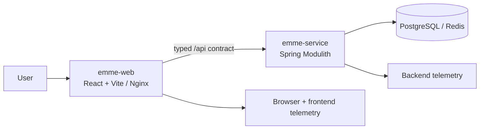

# EMME Web Architecture Handbook

This handbook is the web repository's normative guide. It describes the React
application shell, frontend capabilities, typed service boundary, browser tests,
static image delivery, and operational evidence.

The backend repository owns business truth and canonical HTTP/event contracts:
[emme-service architecture](https://github.com/migangdelzar/emme-service/tree/main/docs/architecture).

## The two-repository model

The repositories release independently when contracts remain compatible. A
breaking contract requires a coordinated compatibility window and migration.

## Handbook map

| Area | Contents |
|---|---|
| [00 — Project](00-project/architecture-model.md) | Frontend lens, Bun workspace, and documentation ownership |
| [02 — Frontend](02-frontend/app.md) | App shell, modules, features, React, Vite, state, testing |
| [03 — Integration](03-integration/frontend-backend.md) | Typed HTTP boundary, contract consumption, E2E topology, compatibility |
| [04 — Delivery](04-delivery/container.md) | Web image, CI, and release promotion |
| [05 — Operations](05-operations/production-readiness.md) | Browser reliability, telemetry, and approval evidence |

## Normative policy links

- [Web principles](../principles.md)
- [Web security](../security.md)
- [Web testing](../testing.md)
- [Git and review](../git.md)
- [Frontend code splitting](../code-splitting.md)
- [Frontend feature template](../templates/frontend-feature-template.md)

## Architecture lenses

- Frontend capability organization groups code by user outcome and ownership.
- Hexagonal thinking protects the API client and runtime boundary from UI code.
- The service's DDD model is consumed through contracts; it is not copied into
  browser packages.
- Build behavior is expressed by Bun workspace scripts and CI capabilities, not
  by a backend Gradle package tree.

## Definition of done

- [ ] Feature ownership and dependency direction are explicit.
- [ ] Loading, empty, error, offline, and authorization states are defined.
- [ ] API contract and runtime configuration are typed and validated.
- [ ] Unit/component and applicable browser evidence exist.
- [ ] Accessibility and security checks pass.
- [ ] Image, CI, deployment, and rollback evidence are available.
- [ ] No credentials, tokens, HAR recordings, or local paths are committed.
