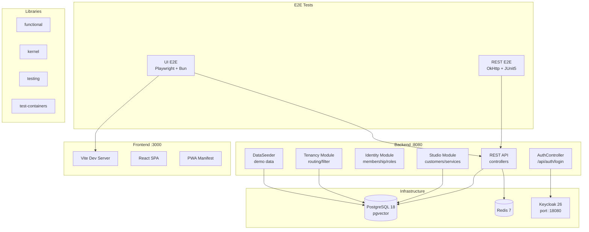
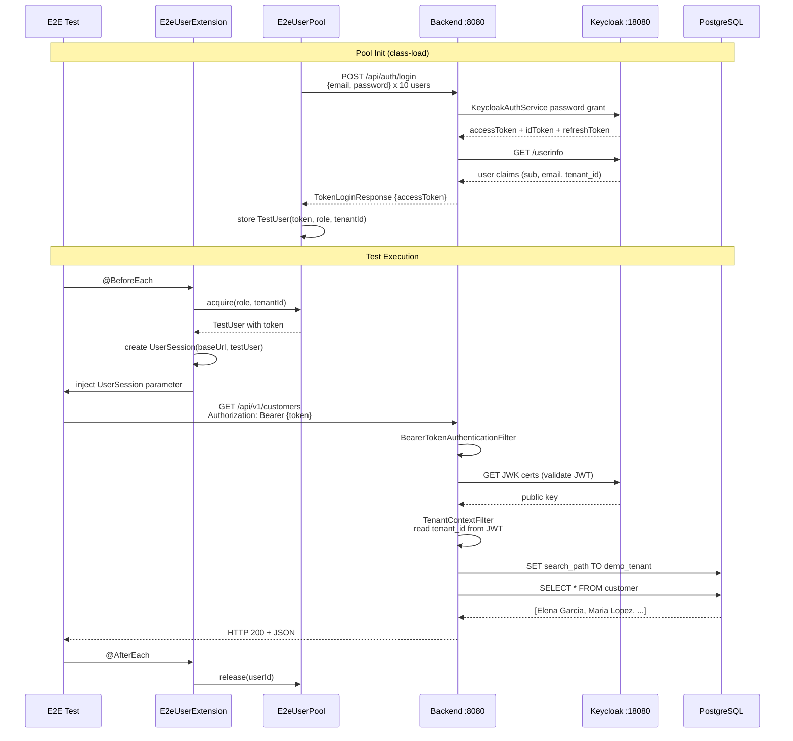
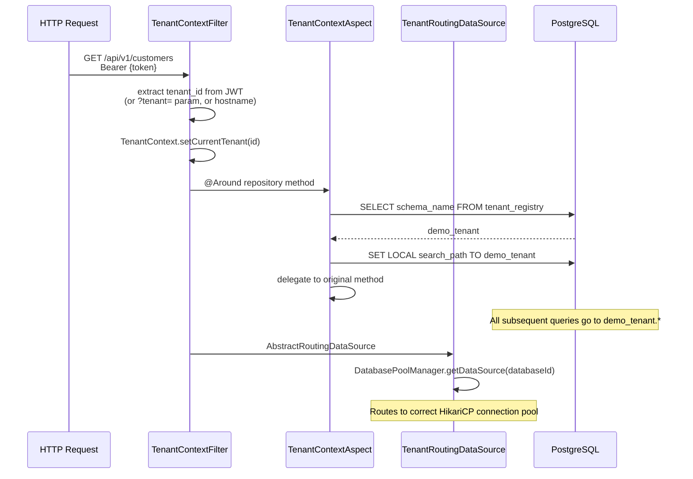
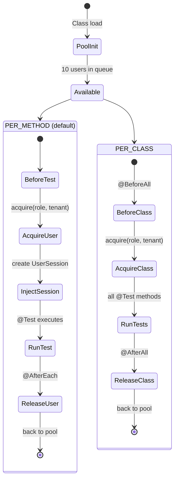
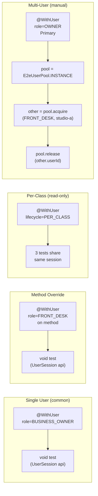
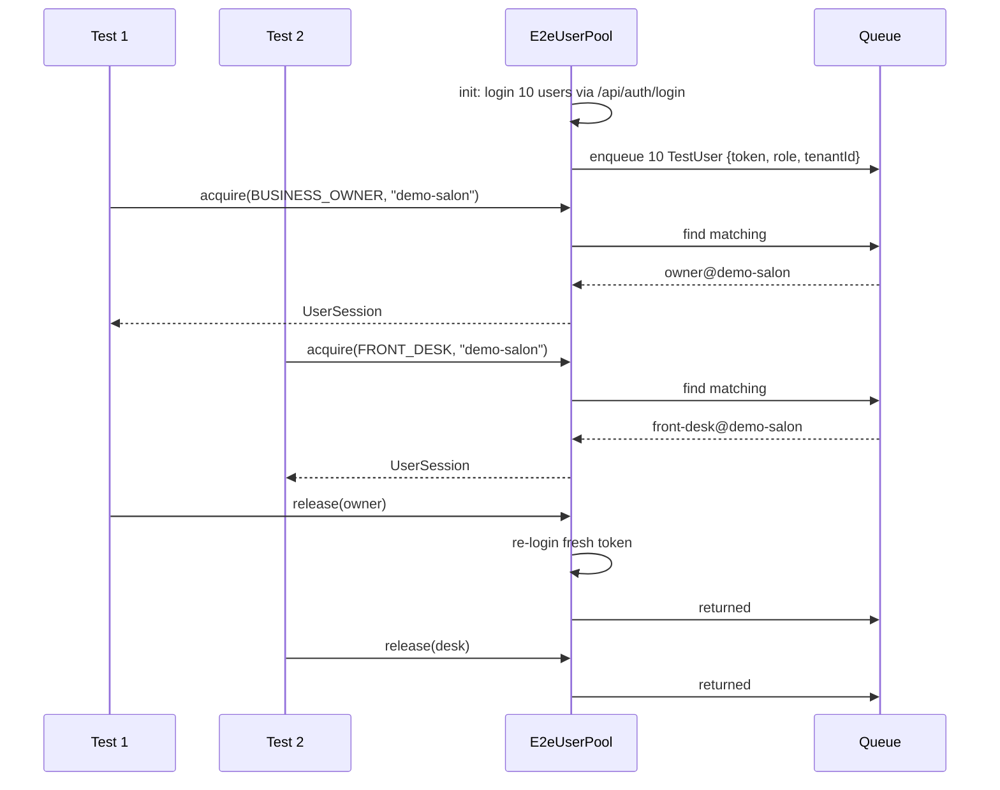
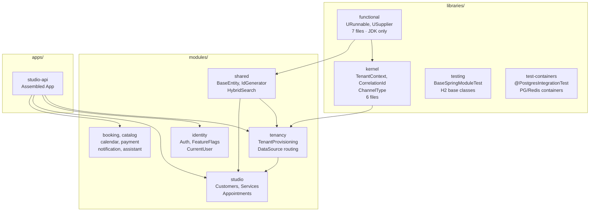
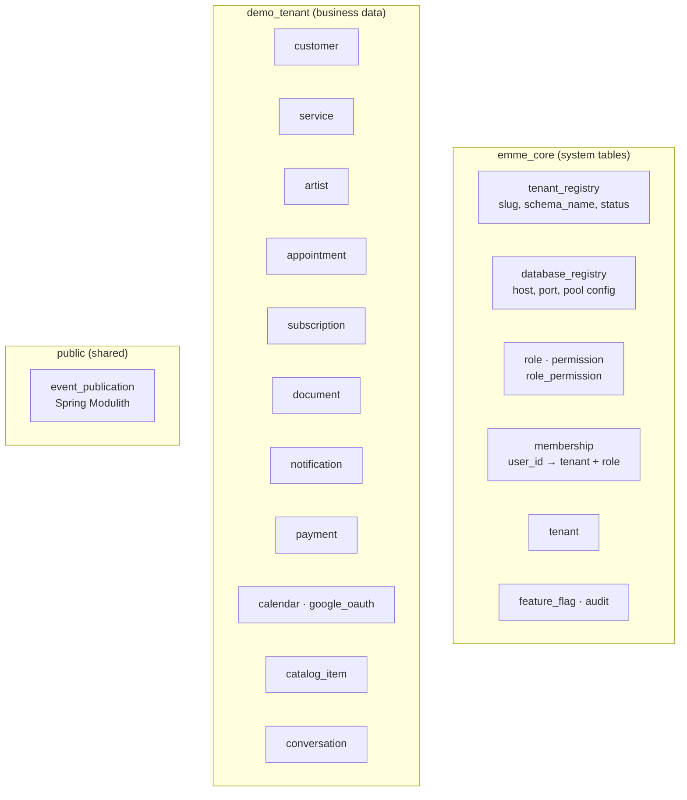
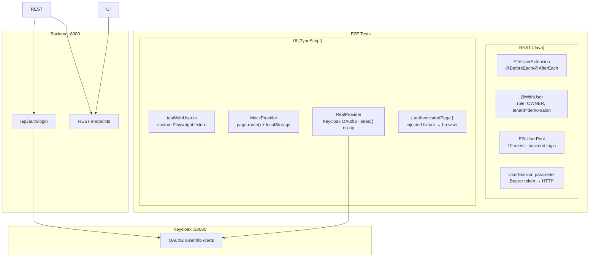

# Emme Nails — Architecture & Code Flow

## System Architecture



---

## Auth Flow



---

## Multi-Tenant Schema Routing



---

## E2E Extension Lifecycle



---

## E2E Test Patterns



---

## E2E User Pool



---

## Library Dependency Graph



---

## Database Schema Layout



---

## REST vs UI E2E — Same Pattern, Different Framework

| Layer | REST E2E (Java) | UI E2E (TypeScript) |
|-------|----------------|---------------------|
| **Extension** | `E2eUserExtension` + `@BeforeEach` | `testWithUser.ts` custom Playwright fixture |
| **Annotation** | `@WithUser(role, tenant)` | `test({ metadata: { mode: 'mock' } })` |
| **Injection** | `UserSession` parameter | `{ authenticatedPage }` fixture |
| **Auth** | `POST /api/auth/login` → Bearer token | `localStorage` token injection (mock) or Keycloak OAuth2 (real) |
| **Multi-user** | `pool.acquire(role, tenant)` | `acquireUser()` from `userPool.ts` |
| **Provider** | — | `MockProvider` (page.route) / `RealProvider` (OAuth2) |

### UI E2E Architecture



### UI E2E Fixture (TypeScript)

```typescript
// testWithUser.ts — Playwright custom fixture (mirrors E2eUserExtension)
import { test as base } from '@playwright/test';

const MODE = process.env.E2E_MODE || 'mock';

export const test = base.extend({
    authenticatedPage: async ({ page, testUser }, use) => {
        if (MODE === 'mock') {
            await new MockProvider().setup(page, testUser);
            await use(page);
        } else {
            await new RealProvider().setup(page);    // Keycloak OAuth2
            await use(page);
        }
    },
    testUser: [async ({}, use) => {
        const user = acquireUser();       // ← UserPool pattern
        await use(user);
        releaseUser(user.userId);
    }, { scope: 'test' }],
});

export { expect } from '@playwright/test';
```

```typescript
// customers.spec.ts — test usage
import { test, expect } from '@fixtures/testWithUser';

test.describe('Customers', () => {
    test.beforeEach(async ({ authenticatedPage, provider }) => {
        await provider.seed({ customers: mockCustomers });
        const clients = new ClientsPage(authenticatedPage);
        await clients.goto();
    });

    test('heading renders', async ({ authenticatedPage }) => {
        await expect(authenticatedPage.getByText('Clientes')).toBeVisible();
    });
});
```

---

## E2E Test Matrix

| Suite | Mode | Provider | Runner | Passed | Failed |
|-------|------|----------|--------|--------|--------|
| **REST E2E** | — | Backend login | JUnit 5 | 9/44 | 35 |
| **UI Mock** | mock | page.route() interception | Playwright | 23/48 | 8 |
| **UI Real** | real | Keycloak OAuth2 | Playwright | 8/48 | 40 |
| **Studio-api** | — | H2 + ArchUnit | JUnit 5 | 12/12 | 0 |
| **Integration** | — | Testcontainers PG | JUnit 5 | compile ✅ | needs Docker |

---

## Dev Quick Start

```bash
# 1. Infrastructure
docker compose up -d
docker-compose exec postgres psql -U emme -d emme \
  -c "CREATE EXTENSION IF NOT EXISTS vector"

# 2. Backend (DevTools hot reload)
SPRING_PROFILES_ACTIVE=local \
  ./gradlew :applications:studio-api:bootRun

# 3. Frontend (Vite HMR)
cd apps/emme-salon-app && bun dev

# 4. REST E2E
EMME_E2E_BASE_URL=http://localhost:8080 \
  ./gradlew :applications:studio-api:e2eTest

# 5. UI E2E Mock
cd e2e/src && bun run test

# 6. Studio-api tests
./gradlew :applications:studio-api:test

# 7. Integration tests (needs Docker)
./gradlew integrationTest
```
