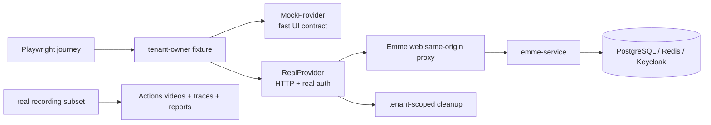

# Tenant-owner E2E and real-stack recording design

| Field | Value |
|---|---|
| Status | Approved design |
| Date | 2026-08-03 |
| Owner | Frontend platform |
| Scope | `emme-web` browser E2E and real-stack recording workflow |
| Reference | Clara `insurance-quotes-web` demo-recording and full-stack E2E pattern |

## Goal

Cover the current Emme tenant-owner browser journeys with two independent test
lanes: a fast deterministic mock lane and a real full-stack lane. GitHub Actions
records and archives only the real full-stack critical journeys; mock recordings
remain a local development tool and are never uploaded by CI.

## Architectural decision

The browser test boundary remains Playwright. The mock provider and real provider
share the same fixture and page-object API, but they are never mixed in one test
run.



The browser must exercise the same-origin web boundary in real mode. Node-side
API calls are limited to deterministic setup and cleanup; they are not a
replacement for browser assertions.

## Journey catalogue

The current tenant-owner UI is covered by these critical journeys:

| Journey | Required outcome | Recording |
|---|---|---|
| Owner sign-in and tenant context | Owner reaches the dashboard with one active tenant membership | Yes |
| Dashboard and navigation | KPIs, agenda summary, and all owner sections render | Yes |
| Service catalog lifecycle | Search, create, edit, retire, and empty state behave correctly | Yes |
| Customer lifecycle | Search, create, edit, and appointment entry point behave correctly | Yes |
| Appointment lifecycle | Create, validate, confirm, complete/cancel when exposed by the UI | Yes |
| Business configuration | Profile, hours, booking policy, and preferences persist | Yes |
| Finances | Tenant-scoped revenue and appointment analytics render | Yes |
| Authorization and tenant isolation | Non-owner/foreign-tenant data is denied or absent | No, assertion-only |
| Failure and recovery | Validation, conflict, unavailable, and retry states recover | No, assertion-only |
| Responsive/accessibility shell | Keyboard focus, landmarks, mobile layout, and no horizontal overflow | No, assertion-only |

Google Calendar/Sheets, payments, notifications, AI, and other provider flows
remain separate future suites until deterministic provider fixtures and safe
credentials exist. They must not be faked inside the tenant-owner recording.

## Test lanes

### Mock lane

- `bun run --filter @emme/e2e test` runs mock tests.
- Mock tests use an in-memory provider and stable synthetic tenant-owner users.
- Mock tests may opt into local video for debugging, but CI does not archive
  them.
- Mock tests must not require a running backend or Keycloak.

### Real lane

- `E2E_MODE=real bun run --filter @emme/e2e test:real` runs against the running
  web/service stack.
- The real fixture logs in through the supported browser flow and obtains setup
  authority only after the browser has authenticated.
- Test data is unique per run, tenant-scoped, and cleaned up through explicit
  provider operations.
- Fixed sleeps are prohibited; waits use visible UI, response predicates, or
  bounded polling.

### Recording lane

- `E2E_MODE=real RECORD_DEMO=true bun run --filter @emme/e2e test:real:recordings`
  runs only tagged critical recording journeys.
- Playwright records videos, traces, screenshots, and JSON/HTML reports.
- GitHub Actions uploads the generated evidence with bounded retention.
- Secrets, access tokens, cookies, HAR files, and response bodies are never
  committed or uploaded as test artifacts.

## Real-provider contract

`RealProvider` must implement the setup/cleanup operations required by the
shared `ApiProvider` contract:

```ts
interface ApiProvider {
  setup(page: Page, user: TestUser): Promise<void>;
  seed(data: SeedData): Promise<void>;
  teardown(): Promise<void>;
  readonly mode: 'mock' | 'real';
  route(pattern: string): RouteConfig;
}
```

Real setup uses the authenticated tenant-owner token. Every created record is
tagged with a deterministic `E2E-<run-id>-<kind>` marker and tracked by ID.
Cleanup is best effort for dependent records first (appointments), followed by
customers and services. A failed cleanup is reported as a test diagnostic and
never silently ignored.

## CI topology

The web repository owns a manually dispatchable real-recording workflow with
explicit web/service refs. The workflow:

1. Checks out the selected web ref and sibling `emme-service` ref.
2. Installs Bun, Java, Gradle dependencies, and Chromium.
3. Starts the deterministic JVM service profile and same-origin web proxy.
4. Waits for health through the browser boundary.
5. Runs real critical tenant-owner recordings serially.
6. Uploads videos, reports, traces, and screenshots with `if: always()`.
7. Tears down the stack and retains artifacts for a limited period.

Native execution is a later comparison job. It must use the native runtime
overlay only after the JVM recording path is green; JVM remains the rollback
artifact.

## Reliability and accessibility rules

- Use stable `data-testid` contracts only when accessible roles and names are
  insufficient.
- Assert visible outcomes, not React implementation details.
- Require zero unexpected console errors in recording journeys.
- Verify same-origin `/api` requests and the `API-Version` header in integration
  assertions.
- Verify one `h1`, named landmarks, focus visibility, keyboard progression, and
  no horizontal overflow on the critical shell.
- Use deterministic dates and explicit fixtures for appointments.
- Keep recording journeys serial when they mutate shared seeded state.

## Success criteria

- Mock E2E runs without the service.
- Real E2E runs through the browser's same-origin service boundary.
- The recording workflow archives only real-stack videos and reports.
- Tenant-owner create/update/read flows are proven by UI outcomes.
- Authorization, error recovery, accessibility, and responsive checks remain
  separate assertions and do not make videos unnecessarily long.
- No credentials or generated recordings enter git history.
