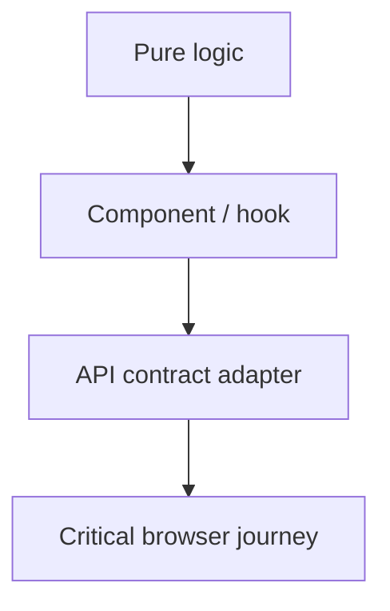

# Web Testing Policy

## Lanes

| Lane | Tool | Purpose |
|---|---|---|
| Unit | Vitest | Pure logic, validation, reducers, adapters |
| Component | Vitest + Testing Library | Observable UI behavior and accessibility semantics |
| Package | TypeScript + package tests | Shared contract and client stability |
| Browser | Playwright | Critical real or explicitly mocked journeys |
| Image smoke | Docker + HTTP | Static serving, health, fallback, headers |

Use the lowest-cost lane that proves the behavior. Browser tests must be
deterministic, isolated, condition-based, and free of committed recordings.
The manual `Playwright demo recordings` workflow may archive deterministic
mock-mode videos and reports as short-lived GitHub Actions artifacts.

Required coverage includes success, empty, loading, error, permission-denied,
offline, retry, duplicate action, responsive, keyboard, and focus behavior when
applicable.
